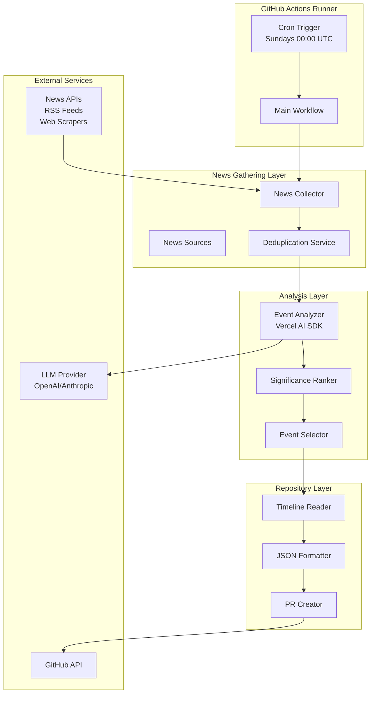

# Design Document

## Overview

The AI News Automation system consists of three main components: a news gathering service that collects AI-related events from multiple sources, an analysis engine that ranks and selects the most significant events using LLM-based evaluation, and a GitHub integration layer that creates pull requests to update the timeline repository. The system runs as a GitHub Action scheduled via cron, leveraging Vercel AI SDK for flexible LLM integration and structured output handling.

The architecture prioritizes modularity, allowing easy addition of new data sources and switching between LLM providers. The system uses TypeScript for type safety and better maintainability, with a clear separation between data collection, analysis, and repository management concerns.

## Architecture



## Technology Decision: Vercel AI SDK vs Claude API

After analysis, **Vercel AI SDK** is the recommended choice for the following reasons:

### Vercel AI SDK Advantages
- **Provider Flexibility**: Supports multiple LLM providers (OpenAI, Anthropic, Google, etc.) with unified interface
- **Structured Output**: Built-in support for Zod schemas and JSON output validation
- **Streaming Support**: Efficient handling of large responses with streaming capabilities
- **Error Handling**: Robust retry logic and error recovery built-in
- **Cost Optimization**: Easy provider switching based on cost/performance needs
- **Type Safety**: Full TypeScript support with generated types from schemas

### Claude API Direct Limitations
- **Vendor Lock-in**: Tied specifically to Anthropic's Claude
- **Manual Implementation**: Requires custom error handling, retries, and output parsing
- **No Structured Output**: Must implement own JSON schema validation
- **Limited Flexibility**: Cannot easily switch to other models if needed

### Recommendation
Use Vercel AI SDK with OpenAI's GPT-4o-mini for cost efficiency, with ability to switch to Claude-3-haiku or other models based on performance requirements.

## Components and Interfaces

### 1. News Collector Service

```typescript
interface NewsSource {
  name: string;
  type: 'api' | 'rss' | 'scraper';
  priority: number;
  fetchEvents(): Promise<RawEvent[]>;
}

interface RawEvent {
  title: string;
  date: Date;
  source: string;
  url: string;
  content: string;
  metadata?: Record<string, any>;
}

class NewsCollector {
  private sources: NewsSource[];
  
  async gatherWeeklyEvents(): Promise<RawEvent[]> {
    // Parallel fetch from all sources
    // Filter to past 7 days
    // Return consolidated list
  }
}
```

### 2. Event Analyzer

```typescript
interface AnalyzedEvent {
  id: string;
  title: string;
  date: string;
  description: string;
  category: 'research' | 'product' | 'regulation' | 'industry';
  sources: string[];
  impactScore: number;
  significance: {
    technologicalBreakthrough: number;
    industryImpact: number;
    adoptionScale: number;
    novelty: number;
  };
}

class EventAnalyzer {
  private ai: VercelAIClient;
  
  async analyzeEvents(events: RawEvent[]): Promise<AnalyzedEvent[]> {
    // Use AI SDK with structured output
    // Return analyzed events with scores
  }
}
```

### 3. GitHub Integration

```typescript
interface TimelineEntry {
  id: string;
  date: string;
  title: string;
  description: string;
  category: string;
  sources: string[];
  impact_score: number;
}

class GitHubManager {
  private octokit: Octokit;
  
  async createPullRequest(events: TimelineEntry[]): Promise<PullRequest> {
    // Create branch
    // Update timeline-events.json
    // Create PR with description
  }
}
```

## Data Models

### Timeline Event Schema

```typescript
const TimelineEventSchema = z.object({
  id: z.string().regex(/^\d{4}-\d{2}-\d{2}-[a-z0-9]+$/),
  date: z.string().datetime(),
  title: z.string().max(200),
  description: z.string().max(1000),
  category: z.enum(['research', 'product', 'regulation', 'industry']),
  sources: z.array(z.string().url()),
  impact_score: z.number().min(0).max(10)
});
```

### News Source Configuration

```typescript
const NewsSourceConfig = z.object({
  enabled: z.boolean(),
  apiKey: z.string().optional(),
  baseUrl: z.string().url(),
  rateLimit: z.object({
    requests: z.number(),
    windowMs: z.number()
  })
});
```

## Data Sources

### Primary Sources
1. **OpenAI Blog API** - Official announcements
2. **Anthropic News** - Claude updates
3. **Google AI Blog RSS** - Research papers and products
4. **ArXiv AI Section** - Academic breakthroughs
5. **HackerNews API** - Community-validated news (high score threshold)
6. **The Verge AI RSS** - Industry coverage
7. **MIT Tech Review** - In-depth analysis

### Source Reliability Scoring
Each source has a reliability weight:
- Official company blogs: 1.0
- Academic sources: 0.9
- Tech journalism: 0.7
- Community sources: 0.6

## Error Handling

### Service-Level Failures

```typescript
class CircuitBreaker {
  private failures: Map<string, number>;
  private lastFailureTime: Map<string, Date>;
  
  async callWithBreaker<T>(
    serviceName: string,
    operation: () => Promise<T>
  ): Promise<T | null> {
    if (this.isOpen(serviceName)) {
      return null;
    }
    
    try {
      const result = await operation();
      this.onSuccess(serviceName);
      return result;
    } catch (error) {
      this.onFailure(serviceName);
      throw error;
    }
  }
}
```

### Retry Strategy
- **Exponential backoff**: 2^n seconds (max 64 seconds)
- **Jitter**: ±20% randomization
- **Max retries**: 3 for API calls, 5 for GitHub operations
- **Circuit breaker**: Opens after 3 consecutive failures

### Graceful Degradation
1. If primary news sources fail, continue with available sources
2. If LLM analysis fails, fall back to rule-based scoring
3. If PR creation fails, save events locally and alert maintainer
4. If all sources fail, skip week and log incident

## Testing Strategy

### Unit Tests
- **News Collectors**: Mock API responses, test parsing logic
- **Event Analyzer**: Test scoring algorithms with fixture data
- **Deduplication**: Test similarity matching algorithms
- **JSON Formatter**: Validate schema compliance

### Integration Tests
- **End-to-end workflow**: Use test repositories
- **API Integration**: Test with sandbox/dev API keys
- **GitHub Actions**: Test workflow in separate environment
- **LLM Integration**: Test with mock responses and real API (limited)

### Performance Tests
- **Rate limiting**: Verify compliance with API limits
- **Timeout handling**: Ensure operations complete within GitHub Actions limits
- **Memory usage**: Profile with large event sets
- **Concurrent processing**: Test parallel source fetching

### Validation Tests
- **Schema validation**: Ensure all outputs match expected formats
- **Content validation**: Verify event descriptions are factual
- **Duplicate detection**: Test deduplication accuracy
- **Ranking consistency**: Verify scoring stability

## Security Considerations

### API Key Management
- Store in GitHub Secrets
- Rotate keys quarterly
- Use least-privilege API scopes
- Monitor usage for anomalies

### Repository Access
- Use GitHub App with minimal permissions
- Scope to specific repositories only
- Require PR reviews before merge
- Audit log all automated actions

### Data Validation
- Sanitize all external input
- Validate JSON schema before commits
- Prevent injection attacks in PR descriptions
- Rate limit automation to prevent abuse

## Configuration

### Environment Variables

```yaml
# .github/workflows/weekly-update.yml
env:
  OPENAI_API_KEY: ${{ secrets.OPENAI_API_KEY }}
  GITHUB_TOKEN: ${{ secrets.GITHUB_TOKEN }}
  TIMELINE_REPO: "username/ai-timeline"
  MAX_EVENTS_PER_WEEK: 3
  SIGNIFICANCE_THRESHOLD: 7.0
  NEWS_SOURCES: "openai,anthropic,arxiv,hackernews"
```

### Scheduling Configuration

```yaml
on:
  schedule:
    - cron: '0 0 * * 0'  # Every Sunday at 00:00 UTC
  workflow_dispatch:     # Manual trigger for testing
```

## Monitoring and Observability

### Metrics to Track
- Events gathered per source
- Events selected vs rejected
- API calls and costs
- Processing time per phase
- Error rates by component
- PR creation success rate

### Logging Strategy
- Structured JSON logs
- Log levels: ERROR, WARN, INFO, DEBUG
- Include correlation IDs
- Ship to GitHub Actions logs
- Optional: Send to external service (Datadog, etc.)

### Alerting Rules
- No events found for 2 consecutive weeks
- API costs exceed threshold
- Circuit breaker opened
- PR creation failures
- Parsing errors on known sources
